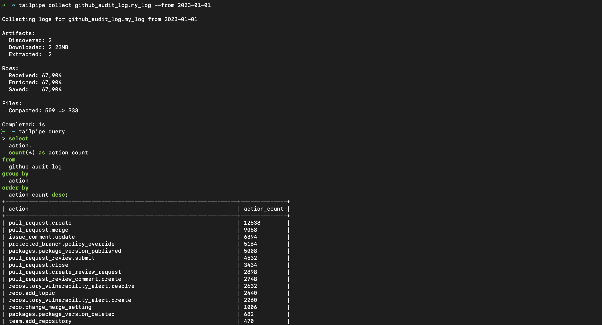
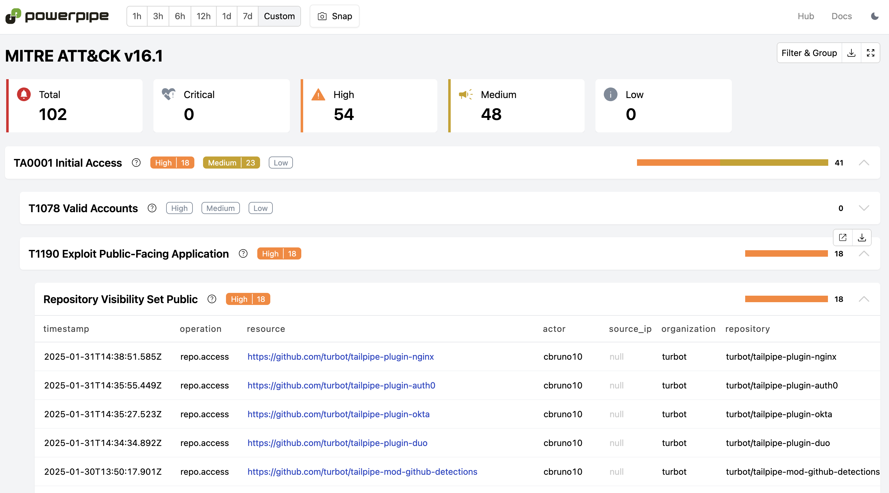

# GitHub Plugin for Tailpipe

[Tailpipe](https://tailpipe.io) is an open-source CLI tool that allows you to collect logs and query them with SQL.

The [GitHub Plugin for Tailpipe](https://hub.tailpipe.io/plugins/turbot/github) allows you to collect and query GitHub audit logs using SQL to track activity, monitor trends, detect anomalies, and more!

- **[Get started →](https://hub.tailpipe.io/plugins/turbot/github)**
- Documentation: [Table definitions & examples](https://hub.tailpipe.io/plugins/turbot/github/tables)
- Community: [Join #tailpipe on Slack →](https://turbot.com/community/join)
- Get involved: [Issues](https://github.com/turbot/tailpipe-plugin-github/issues)

Collect and query logs:


## Getting Started

Install Tailpipe from the [downloads](https://tailpipe.io/downloads) page:

```sh
# MacOS
brew install turbot/tap/tailpipe
```

```sh
# Linux or Windows (WSL)
sudo /bin/sh -c "$(curl -fsSL https://tailpipe.io/install/tailpipe.sh)"
```

Install the plugin:

```sh
tailpipe plugin install github
```

Configure your [connection credentials](https://hub.tailpipe.io/plugins/turbot/github#connection-credentials), table partition, and data source ([examples](https://hub.tailpipe.io/plugins/turbot/github/tables/github_audit_log#example-configurations)):

```sh
vi ~/.tailpipe/config/github.tpc
```

```hcl
partition "github_audit_log" "audit_log" {
  source "file"  {
		paths = ["/Users/dir/path"]
		file_layout = "export-turbot-%{NUMBER:prefix}.json"
  }
}
```

Download, enrich, and save logs from your source ([examples](https://tailpipe.io/docs/reference/cli/collect)):

```sh
tailpipe collect github_audit_log
```

Enter interactive query mode:

```sh
tailpipe query
```

Run a query:

```sql
select
  action,
  count(*) as action_count
from
  github_audit_log
group by
  action
order by
  action_count desc;
```

```sh
+----------------------------------------------------------------------+--------------+
| action                                                               | action_count |
+----------------------------------------------------------------------+--------------+
| pull_request.create                                                  | 9894         |
| pull_request.merge                                                   | 7440         |
| issue_comment.update                                                 | 5832         |
| packages.package_version_published                                   | 4990         |
| protected_branch.policy_override                                     | 4012         |
| pull_request_review.submit                                           | 3672         |
| pull_request_review_comment.create                                   | 2516         |
| pull_request.close                                                   | 2462         |
| pull_request.create_review_request                                   | 2438         |
| repository_vulnerability_alert.create                                | 1972         |
| repository_vulnerability_alert.resolve                               | 1486         |
+----------------------------------------------------------------------+--------------+
```

## Detections as Code with Powerpipe

Pre-built dashboards and detections for the GitHub plugin are available in [Powerpipe](https://powerpipe.io) mods, helping you monitor and analyze activity across your GitHub accounts.

For example, the [GitHub Audit Logs Detections mod](https://hub.powerpipe.io/mods/turbot/tailpipe-mod-github-audit-log-detections) scans your audit logs for anomalies, such as monitor SSH key additions to user accounts, admin role assignments in GitHub teams.

Dashboards and detections are [open source](https://github.com/topics/tailpipe-mod), allowing easy customization and collaboration.

To get started, choose a mod from the [Powerpipe Hub](https://hub.powerpipe.io/?engines=tailpipe&q=github).



## Developing

Prerequisites:

- [Tailpipe](https://tailpipe.io/downloads)
- [Golang](https://golang.org/doc/install)

Clone:

```sh
git clone https://github.com/turbot/tailpipe-plugin-github.git
cd tailpipe-plugin-github
```

After making your local changes, build the plugin, which automatically installs the new version to your `~/.tailpipe/plugins` directory:

```sh
make
```

Re-collect your data:

```sh
tailpipe collect github_audit_log
```

Try it!

```sh
tailpipe query
> .inspect github_audit_log
```

## Open Source & Contributing

This repository is published under the [Apache 2.0](https://www.apache.org/licenses/LICENSE-2.0) (source code) and [CC BY-NC-ND](https://creativecommons.org/licenses/by-nc-nd/2.0/) (docs) licenses. Please see our [code of conduct](https://github.com/turbot/.github/blob/main/CODE_OF_CONDUCT.md). We look forward to collaborating with you!

[Tailpipe](https://tailpipe.io) is a product produced from this open source software, exclusively by [Turbot HQ, Inc](https://turbot.com). It is distributed under our commercial terms. Others are allowed to make their own distribution of the software, but cannot use any of the Turbot trademarks, cloud services, etc. You can learn more in our [Open Source FAQ](https://turbot.com/open-source).

## Get Involved

**[Join #tailpipe on Slack →](https://turbot.com/community/join)**

Want to help but don't know where to start? Pick up one of the `help wanted` issues:

- [Tailpipe](https://github.com/turbot/tailpipe/labels/help%20wanted)
- [GitHub Plugin](https://github.com/turbot/tailpipe-plugin-github/labels/help%20wanted)
